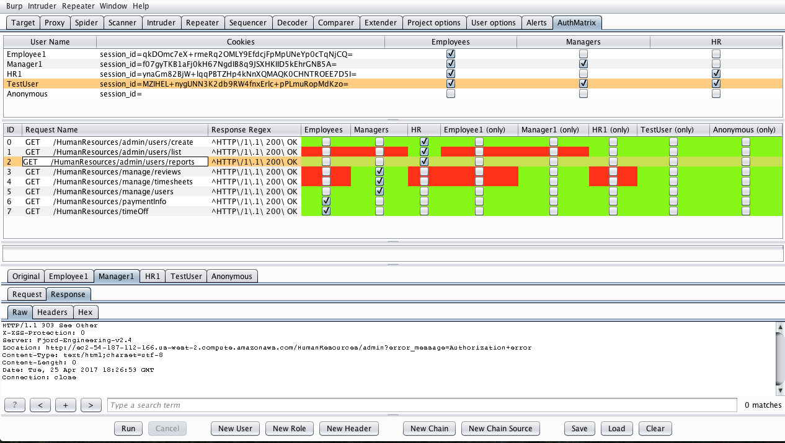
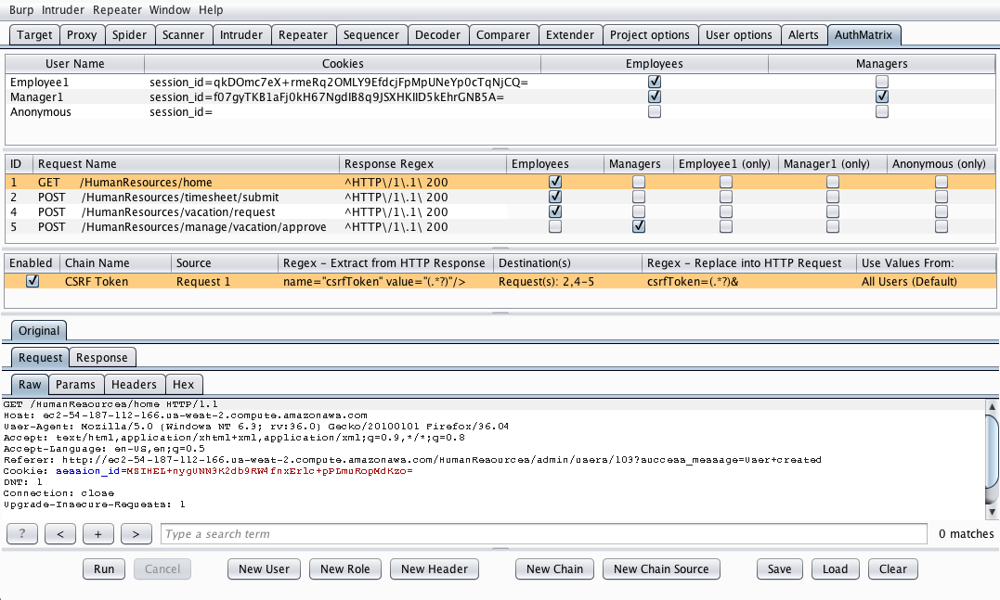
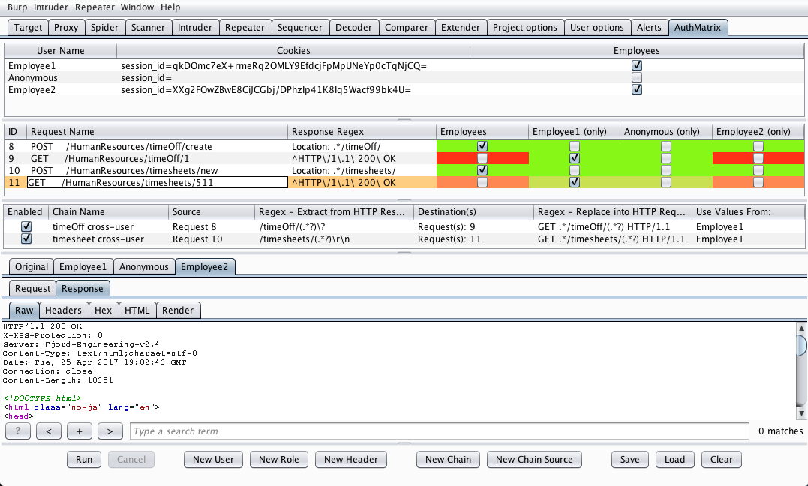
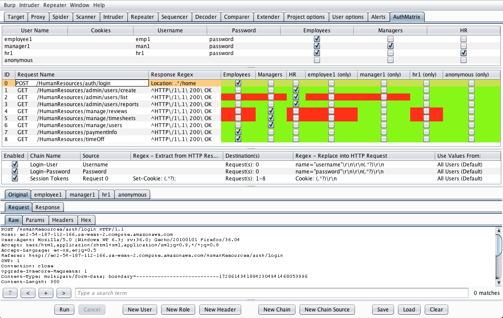
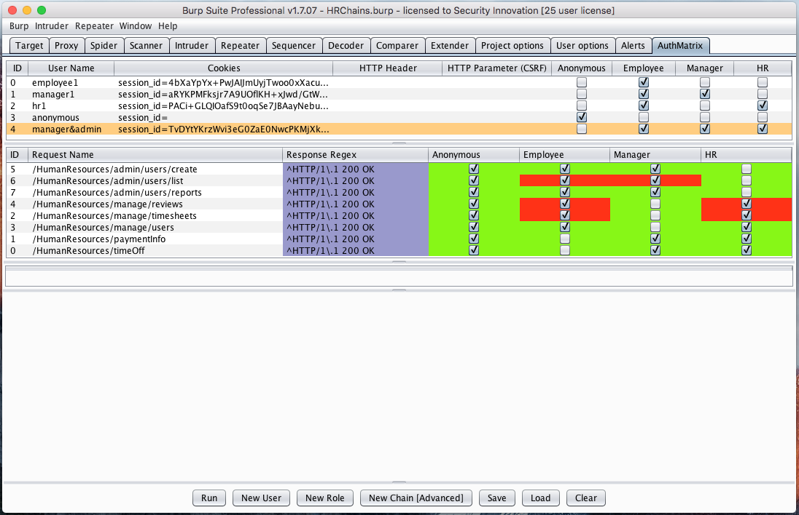

# AuthMatrix v0.7

AuthMatrix is an extension to Burp Suite that provides a simple way to test authorization in web applications and web services. With AuthMatrix, testers focus on thoroughly defining tables of users, roles, and requests for their specific target application upfront. These tables are structured in a similar format to that of an access control matrix common in various threat modeling methodologies.

Once the tables have been assembled, testers can use the simple click-to-run interface to kick off all combinations of roles and requests. The results can be confirmed with an easy to read, color-coded interface indicating any authorization vulnerabilities detected in the system. Additionally, the extension provides the ability to save and load target configurations for simple regression testing.

# Installation

AuthMatrix can be installed through the Burp Suite BApp Store. From within Burp Suite, select the Extender tab, select the BApp Store, select AuthMatrix, and click install.

For Manual installation, download AuthMatrix.py from this repository.  Then from within Burp Suite, select the Extender tab, click the Add button, change the Extension type to Python, and select the AuthMatrix python file.

### Note

AuthMatrix requires configuring Burp Suite to use Jython.  Easy instructions for this are located at the following URL.

https://portswigger.net/burp/help/extender.html#options_pythonenv

Be sure to use Jython version 2.7.0 or greater to ensure compatibility.

# Basic Usage

1. Create roles for all privilege levels within the target application.  (Common roles may include User, Admin, and Anonymous)

2. Create enough users to fit these various roles and select the checkboxes for all roles that the user belongs to. "Single-User" roles containing just the one user will be configured automatically to assist in cross-user resource testing.

3. Generate session tokens for each user from the Repeater tab and enter them into the relevant column within the Users Table. Cookies can be sent directly to the users via the right click menu available in Repeater. AuthMatrix will intelligently parse the cookie string from the table and substitute/add them to the requests where applicable.

    * NOTE: The Cookies field is optional. If the target uses HTTP headers instead, these can be added by clicking the "New Header" button.

4. From another area of Burp Suite (i.e. Target tab, Repeater Tab, etc) right click a request and select "Send to AuthMatrix." 

5. In the Request Table of AuthMatrix, select the checkboxes for all roles that are authorized to make each HTTP request.

6. Customize a Response Regex based on the expected response behavior of the request to determine if the action has succeeded. 

    * Common regexes include HTTP Response headers, success messages within the body, or other variations within the body of the page.

    * NOTE: Requests can be configured to use a Failure Regex instead through the right-click menu (i.e. Anonymous should never receive an HTTP 200)

7. Click Run at the bottom to run all requests or right click several requests and select run.  Observe that the adjacent table will show color-coded results.

    * Green indicates no vulnerability detected

    * Red indicates the request may contain a vulnerability

    * Blue indicates that the result may be a false positive.  (This generally means there is an invalid/expired session token or an incorrect regex)

## Sample AuthMatrix Configuration

## False Positives Detected (Invalid Session Tokens)

# Advanced Usage

## Chains

Chains provide a way to copy a static or dynamic value into the body of a request. These values can be pulled from the response of a previously run request (using a regex) or by specifing user-specific static string values.

The most common use cases for Chains are:

1. Populating requests with valid CSRF Tokens

2. Testing newly created IDs/GUIDs for cross-user authorization issues

3. Automating authentication and session refreshing

A Chain entry has the following values:

* __Chain Name:__ a descriptive name

* __Source:__ a static user string defined in the User Table or the ID of the source request in the Request table

* __Extraction Regex:__ a regex used to extract a value from the response of the source request. This field is only used when a Request is specified in the previous field. If used, this must contain one parenthesis grouping that is to be extracted [i.e. (.*)]

* __Destinations:__ a list of Request IDs that the source value will be replaced into.

* __Replacement Regex:__ a regex used to determine where the source value is to be inserted.  This must contain one parenthesis grouping to be replaced [i.e. (.*)]

* __Use Values From:__ specify whether to use the source value obtained from one selected user (useful for cross-user resource tests) or to use the values from all users and place them into their corresponding user's destination requests (useful for automation tasks like CSRF token retrieval)

__NOTE:__ Requests are run in order of row, so the destination requests must be listed after any source requests in order to successfully replace the value.  Requests can be moved in the table by selecting and dragging the entry.

## Chains for CSRF

## Chains for Cross-User Resource Tests

## Chains for Authenticating Users

## Failure Regex Mode

For certain targets, it may be easier to configure AuthMatrix to detect the response condition of when a request has failed. For example, if a target site returns unique data on successful requests, but always returns an HTTP 303 when an unauthorized action is performed. 

In this mode, AuthMatrix will validate this regex for all users not part of a succeeding role.

To do this, right click the request and select "Toggle Regex Mode".  The regex field will be highlighted in purple to indicate that AuthMatrix will run the request in Failure Regex Mode.

__NOTE:__ False positive detection and highlighting may not work in Failure Regex Mode

## Sample Configuration with Failure Regex Mode

